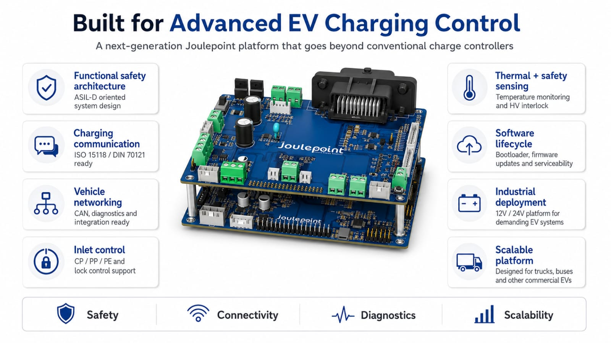
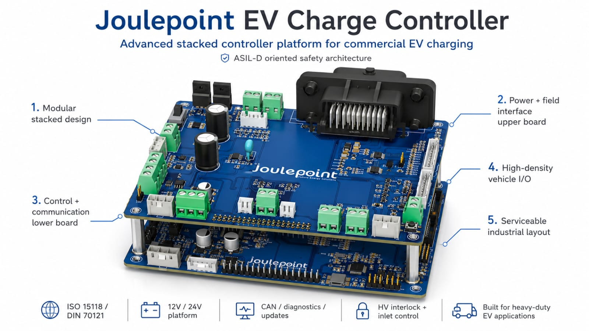
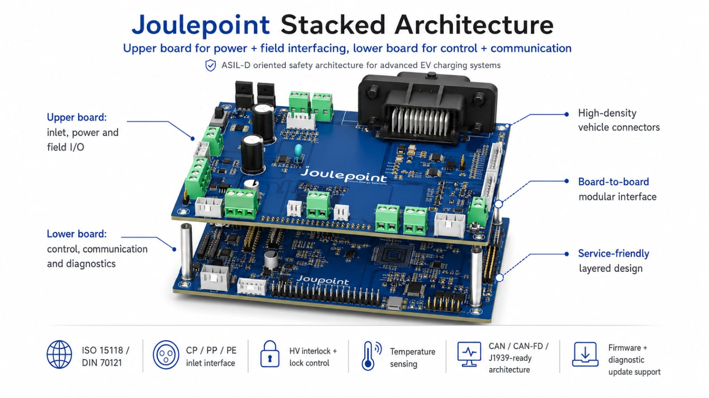
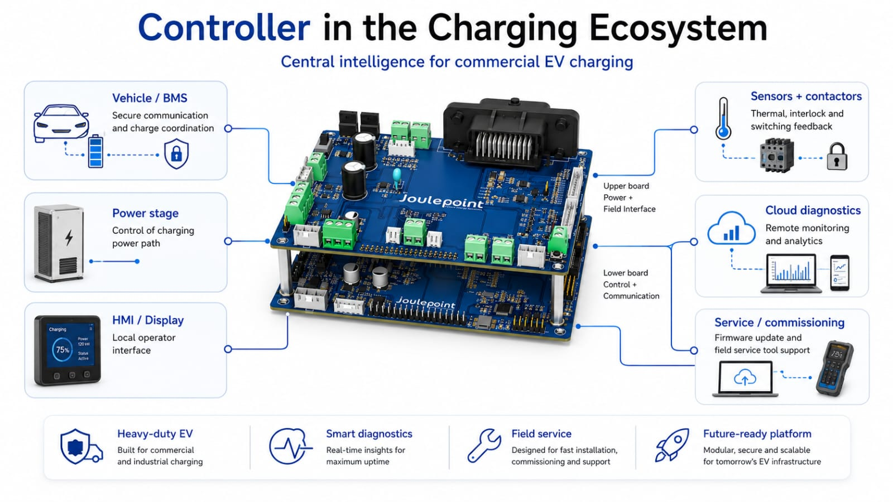

# Board A V0.4 Product Brief

## Introduction

Board A V0.4 is an EV charge-control and vehicle-interface controller board centered on the SPC58NH92 MCU family. The supplied evidence shows charge inlet supervision, PLC/QCA charging communication, CAN/CAN-FD connectivity, HV feedback and switch-control paths, lock control, temperature sensing, service USB/UART, and JTAG/reset access.

This brief is evidence-bounded. Electrical ratings, dimensions, certifications, and environmental limits should be published only after signed schematic, PCB, BOM, stackup, and bench-test evidence is attached.

## Board Views

## Product Visuals

## Visual Evidence Summary

| Visual | What It Adds To The Report |
| --- | --- |
| Advanced EV charging control feature overview | Shows the customer-facing capability story: safety, charging communication, networking, inlet control, thermal sensing, lifecycle support, industrial deployment, and scalability. |
| EV charge controller product callouts | Labels the stacked modular design, upper-board power/field interface, lower-board control/communication layer, high-density I/O, and serviceable layout. |
| Stacked architecture overview | Explains the architecture split between upper inlet/power/field I/O and lower control, communication, and diagnostics. |
| Charging ecosystem context | Places the controller between vehicle/BMS, power stage, HMI/display, sensors/contactors, cloud diagnostics, and service/commissioning. |

## Application

- EV charge-inlet controller or prototype validation board for CP, PP, PE, lock, feedback, and temperature signal paths.
- Vehicle integration board for CAN/CAN-FD communication between VCU, charger, DC/DC, and charge-control subsystems.
- Engineering bring-up platform for PLC/QCA charging communication, JTAG/reset access, USB/UART service, and HV interface validation.

## Key Features

- SPC58NH92 MCU-centered control architecture.
- Charge inlet evidence for CP, PP, PE, CP switch controls, proximity feedback, lock motor control, and lock feedback.
- Vehicle and charging communication evidence for CAN-FD, VCU CAN, charge CAN, PLC/QCA charging communication, USB/UART service, and JTAG/reset access.
- HV interface evidence for feedback, interlock generator/detector, low-side switch control, and all-closed feedback.
- Production package evidence includes Gerber/drill outputs and a manufacturing note calling out impedance-controlled high-speed routing and 1.6 mm PCB thickness preference.

## Operational Data

| Parameter | Evidence / Value | Release Status |
| --- | --- | --- |
| Schematic evidence | 12-page schematic PDF plus EasyEDA package | Reviewable |
| Board visuals | Two 3D PCB renders supplied | Included |
| Connector candidates | 50 EasyEDA connector candidates detected | Condensed below |
| Manufacturing evidence | Gerber/drill archive plus PCB order note | Needs signed fab stackup |
| High-speed routing | 90-120 ohm impedance note, data-rate note above 10 Mbps | Needs fab constraint confirmation |
| Environmental ratings | Not supplied in source evidence | Add component/enclosure rating and thermal test evidence |

## Interfaces

| Interface Area | Ports / Evidence | Use In Product | Confirmation Needed |
| --- | --- | --- | --- |
| Charge inlet | U187, U188, U184, CP/PP/PE, CP switch, proximity, lock feedback | Connects inlet state and lock/control signals to the MCU domain | Pinout, polarity, lock motor current, and inlet harness label |
| Vehicle and charger CAN | U22, U17, U19, VCU_CAN, CHARGE_CAN, CANH/CANL | Links the board to VCU, charger, and external CAN tools | Termination, baud rate, transceiver supply, and message ownership |
| PLC / charging communication | CN34, PLC, CP_PLC, QCA/SPI signals | Provides PLC-related charging communication evidence | Coupling network, isolation policy, SPI timing, and EMC review |
| HV feedback and interlock | P6/P7, MCU_HV_FB, VTH_IL, HVSW feedback lines | Monitors HV path state and interlock thresholds | Scaling, thresholds, isolation boundary, and fault reaction |
| Switch and power-converter control | P8/P9, AFEJ1, DCDCJ1 | Provides OBC/DC/DC/gate-drive control and feedback paths | Gate-drive limits, PWM ownership, current sense scaling, and safe state |
| Service and programming | USB1, CN1, RESET, JTAG signals | Supports firmware load, service UART, and board bring-up | Debug voltage level, protection, boot mode, and production access policy |

## Working Explanation

In simple terms, Board A V0.4 acts as the coordination point between the vehicle, the charging inlet, power-stage hardware, sensing paths, and service tools. The upper board is treated as the power and field-interface layer: it exposes inlet, HV feedback, interlock, switch-control, and external wiring paths. The lower board is treated as the control and communication layer: it carries the MCU, communication, diagnostics, and service-access functions.

When the system is used in an EV charging environment, the controller reads the inlet and safety signals, communicates with vehicle or charger networks, watches thermal and feedback paths, and provides the control hooks needed by OBC, DC/DC, contactor, or switch-control hardware. The annotated visuals are presentation evidence for this architecture, while the schematic/EasyEDA/Gerber files remain the technical evidence for release.

## Stacked Board Architecture

Board A V0.4 is best explained as a two-layer controller stack. The upper board is the field-facing layer: it is closest to the vehicle harness, inlet, high-density I/O, power-stage controls, feedback lines, and serviceable terminal connectors. The lower board is the intelligence layer: it carries the control, communication, diagnostics, firmware, and service-access functions that interpret those field signals and coordinate the charging-control behavior.

| Stack Layer | Main Work | Release Confirmation Needed |
| --- | --- | --- |
| Upper board | Inlet, power and field I/O, terminal blocks, high-density vehicle connector, HV feedback/interlock paths, lock and switch-control paths, and serviceable wiring points. | Harness connector labels, mating connectors, pin 1 orientation, current limits, creepage/clearance, isolation boundary, and enclosure keep-outs. |
| Lower board | MCU control, communication, diagnostics, firmware/service access, CAN/CAN-FD paths, USB/UART service, JTAG/reset, and lower-level signal processing. | MCU part, firmware image, boot mode, debug access policy, CAN termination, service connector behavior, and update workflow. |
| Board-to-board interface | Power references, logic-level control lines, conditioned sensor/feedback signals, communication lines, and command/status paths between boards. | Connector pinout, mating height, insertion depth, mechanical retention, ground return strategy, and no-load continuity. |

## Upper Board Detail

The upper board is the part an installer or harness designer will naturally see as the field interface. Its visible role is to gather external wiring and route it into controlled electronics. The large vehicle connector, green terminal blocks, white harness connectors, and upper-side serviceable connector field all point to this board being responsible for field wiring, inlet-related signals, and power-stage related control/feedback paths.

Functionally, the upper board should be treated as the layer that receives or exposes CP, PP, PE, lock, temperature, HV feedback, HV switch/interlock, DC/DC, OBC/AFE, and field wiring signals. During review, every external connector on this layer should be mapped to its mating harness, voltage/current class, signal direction, and safe handling note.

## Lower Board Detail

The lower board is the controller and diagnostics layer. Its job is to provide the decision-making and service layer for the stack: reading conditioned signals from the upper board, managing communication links, supporting firmware access, and producing control/status outputs back into the field-interface layer.

Before external field wiring or HV-related simulation is connected, the lower board should prove its rails, reset behavior, debug/programming access, USB/UART service path, CAN/CAN-FD behavior, firmware boot state, and diagnostic visibility.

## How The Boards Stack Together

The stack should be assembled as a mechanically supported sandwich: lower board at the base, spacers/standoffs at the mounting points, board-to-board connector aligned, then upper board seated evenly without twisting. The service gap between boards must remain large enough for connector bodies, solder joints, airflow, insulation distance, and service access.

| Step | Stack-Up Action | Why It Matters |
| --- | --- | --- |
| 1 | Identify lower board orientation, mounting holes, board-to-board connector position, and pin 1 markers. | Prevents rotated or offset mating. |
| 2 | Install standoffs and verify equal height before mating the boards. | Keeps the boards parallel and prevents connector stress. |
| 3 | Seat the upper board straight down into the board-to-board connector. | Avoids bent pins and keeps all paths aligned. |
| 4 | Check clearance around the high-density connector, terminal blocks, USB/service areas, and tall capacitors. | Prevents enclosure, harness, and service-tool interference. |
| 5 | Perform no-power continuity checks across ground, expected supply pins, and sensitive nets. | Catches assembly or mating faults before current is applied. |

## Signal Flow Through The Stack

| Signal Family | Enters / Lives On | Travels To | Purpose |
| --- | --- | --- | --- |
| CP, PP, PE and inlet state | Upper board / inlet connector area | Lower board MCU domain | Detect plug state, inlet condition, and charging readiness. |
| Lock, interlock, thermal and feedback signals | Upper board field interface | Lower board monitoring logic | Support safety monitoring, diagnostics, and fault reaction. |
| CAN/CAN-FD, service, firmware and diagnostics | Lower board communication domain | Vehicle, service tool, or upper-board status paths | Coordinate with VCU/charger tools and maintain update/service access. |
| OBC, DC/DC and switch-control paths | Lower board control logic and upper board field outputs | Power-stage related connectors | Drive or supervise charger/power-converter control behavior after validation. |

## Stacked Bring-Up Sequence

| Order | Bring-Up Action | Acceptance Evidence |
| --- | --- | --- |
| 1 | Inspect both boards separately for solder bridges, missing parts, bent connectors, cracked joints, and standoff damage. | Visual inspection photos and issue log. |
| 2 | Power the lower board alone if the design permits separate control-side bring-up. | Rails stable, current draw expected, reset/boot behavior clean. |
| 3 | Confirm USB/UART, JTAG/reset, CAN/CAN-FD, and firmware visibility on the lower board. | Programming log, serial log, CAN test, and reset behavior captured. |
| 4 | Mate the upper board using standoffs and board-to-board connector alignment checks. | No bent pins, boards parallel, connector fully seated, no mechanical interference. |
| 5 | Perform no-load continuity and resistance checks across power, ground, and sensitive signal groups. | Continuity sheet attached to the report. |
| 6 | Power the complete stack with current limiting and no external high-energy wiring. | Current profile, rail measurements, and thermal spot check recorded. |
| 7 | Validate inlet, lock, temperature, HV feedback, interlock, OBC/AFE, and DC/DC interfaces with simulation or safe low-voltage fixtures. | Pass/fail table with measured voltage, logic state, and firmware interpretation. |
| 8 | Connect vehicle/charger/CAN/HMI/service ecosystem elements one at a time. | Communication logs, diagnostic screenshots, and fault-recovery behavior captured. |

## Connector Overview

| Port | Interface / Purpose | Important Signals | How It Is Used |
| --- | --- | --- | --- |
| CN1 | JTAG, reset, and programming access | JTAG_TD1, JTAG_TDO, JTAG_TCK, JTAG_TMS, RESET, VDD_HV_IO_MAIN, GND | Firmware loading, reset verification, and controlled engineering debug access |
| USB1 | USB service and UART bridge | 5V_USB, 3V3_USB, GND_USB, TX_OUT_USB, RX_IN_USB | Service connection for USB/UART bring-up, logs, and bench communication |
| CN34 | PLC / charging communication interface | PLC, CP_PLC, SPI_SCK, SPI_MOSI, SPI_MISO, SPI_CS, STEMP_RESET, STEMP_STATUS | PLC/QCA communication path associated with charge communication evidence |
| U22 | CAN-FD DB9 channel | CANH1, CANL1, +5V, GND, STBY | CAN/CAN-FD connection for vehicle, charger, or diagnostic network testing |
| U17 | CAN-FD DB9 channel | CANH2, CANL2, +5V, GND, STBY | CAN/CAN-FD connection for vehicle, charger, or diagnostic network testing |
| U19 | CAN-FD DB9 channel | CANH3, CANL3, +5V, GND, STBY | CAN/CAN-FD connection for vehicle, charger, or diagnostic network testing |
| U187 | 10-pin communications and inlet breakout | VCU_CAN, CHARGE_CAN, CP_READ, PE_REF, PP_TO_MCU, HVSW feedback | Charge inlet and vehicle-interface breakout for CP, PP, PE, lock, and feedback signals |
| U188 | 2x20 main signal breakout | CAN, HV switch, interlock, lock, LEDs, temp ADC, CP switch signals | Main engineering breakout for charge-control, feedback, and status signals |
| U189 | 5-pin temperature ADC connector | TEMP1_ADC, TEMP2_ADC, TEMP3_ADC, TEMP4_ADC, TEMPGND | Temperature-sense input path; validate ADC scaling and sensor wiring |
| U184 | CP switch selector header | CP_SW1_MCU through CP_SW5_MCU, PP_TO_MCU, PE_REF, CP_READ | CP switch and inlet-signal selection/validation header |
| P6 / P7 | HV feedback / interlock threshold terminal pair | MCU_HV_FB1, MCU_HV_FB2, VTH_IL1, VTH_IL2, VIN, GND | HV feedback and interlock threshold interface |
| P8 / P9 | HV low-side switch control terminal pair | ENB_HV_LS1/2, PWM_HV_LS1/2, GATE_HV_LS1/2 | HV switch or gate-control validation path |
| AFEJ1 | On-board charger / AFE interface | PWM, AC sense ADC, output over-current, VP/VO/VS supply rails | On-board charger or AFE control path |
| DCDCJ1 | DC/DC converter control interface | DCPWM, SR_PWM, CS, DC_OV, OUTPUT_OC, CAN_5V, SGND/AGND | DC/DC converter control and feedback path |

## Functional Description

During use, the MCU domain reads inlet-related CP, PP, PE, proximity, lock, temperature, HV feedback, and interlock-related signals while coordinating communication through CAN/CAN-FD and PLC-related interfaces. The OBC, DC/DC, and switch-control connectors provide the board-level hooks for charger and power-path coordination. USB/UART and JTAG/reset remain service and development interfaces and should be treated as controlled access points in a production enclosure.

## Manufacturing And Qualification Notes

- Use the supplied Gerber/drill package for fabrication review, but keep release blocked until stackup, impedance rules, copper weight, soldermask, drill table, and assembly notes are signed.
- The order note recommends 1.6 mm PCB thickness and 1 oz copper; any thickness change should trigger impedance review.
- Run native EasyEDA ERC/DRC and export the reports into the documentation intake before customer release.
- Bench-check CP/PP/PE behavior, CAN termination, PLC coupling, lock motor polarity, HV feedback scaling, interlock thresholds, temperature ADC scaling, USB/UART service, and JTAG/reset access.

## Release Checklist

- Confirm every external connector label against enclosure/front-panel artwork and harness drawings.
- Add measured voltage, current, thermal, isolation, communication, and fault-reaction logs.
- Publish electrical limits, environmental limits, connector mating information, and compliance claims only after source evidence is attached.
