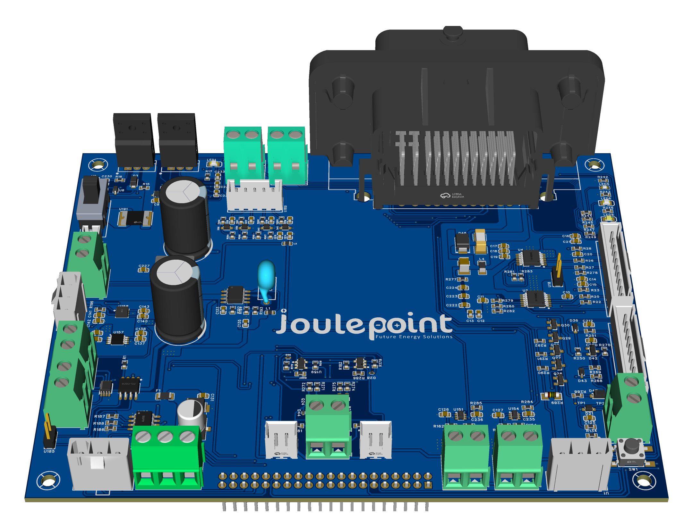
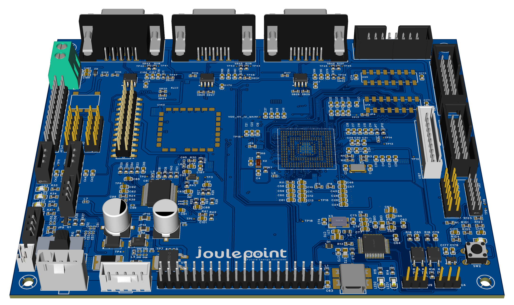

# Board A V0.4 Product Brief

Board A V0.4 is documented here as an evidence-derived EV charge-control and vehicle-interface controller board. This page is based on the supplied EasyEDA project, schematic PDF, Gerber package, manufacturing note, and 3D PCB renders. Any rating not visible in the supplied evidence remains a release confirmation item.

## Key Features

- SPC58NH92 MCU-centered controller architecture.
- Charge inlet evidence for CP, PP, PE, CP switch controls, proximity feedback, lock motor control, and lock feedback.
- Vehicle/charging communication evidence for CAN-FD, VCU CAN, charge CAN, PLC/QCA charging communication, USB/UART service, and JTAG/reset access.
- HV interface evidence for feedback, interlock generator/detector, low-side switch control, and all-closed feedback.
- Production package evidence includes Gerber/drill outputs and a manufacturing note calling out impedance-controlled high-speed routing and 1.6 mm PCB thickness preference.

## Technical Snapshot

| Parameter | Evidence | Release Status |
| --- | --- | --- |
| Schematic evidence | 12-page schematic PDF plus EasyEDA package | Reviewable |
| Board visuals | Two 3D PCB renders supplied | Included |
| Connector candidates | 50 EasyEDA connector candidates detected | Condensed below |
| Manufacturing evidence | Gerber/drill archive plus PCB order note | Needs signed fab stackup |
| High-speed routing | 90-120 ohm impedance note, data-rate note above 10 Mbps | Needs fab constraint confirmation |

## Port And Interface Map

| Port | What It Is | Main Signals / Use | Evidence Page |
| --- | --- | --- | --- |
| CN1 | JTAG, reset, and programming access | JTAG_TD1, JTAG_TDO, JTAG_TCK, JTAG_TMS, RESET, VDD_HV_IO_MAIN, GND | JTAG-RESET / CONNECTORS |
| USB1 | USB service and UART bridge | 5V_USB, 3V3_USB, GND_USB, TX_OUT_USB, RX_IN_USB | USB_UART |
| CN34 | PLC / charging communication interface | PLC, CP_PLC, SPI_SCK, SPI_MOSI, SPI_MISO, SPI_CS, STEMP_RESET, STEMP_STATUS | QCA / CONNECTORS |
| U22 | CAN-FD DB9 channel | CANH1, CANL1, +5V, GND, STBY | CAN-FD |
| U17 | CAN-FD DB9 channel | CANH2, CANL2, +5V, GND, STBY | CAN-FD |
| U19 | CAN-FD DB9 channel | CANH3, CANL3, +5V, GND, STBY | CAN-FD |
| U187 | 10-pin communications and inlet breakout | VCU_CAN, CHARGE_CAN, CP_READ, PE_REF, PP_TO_MCU, HVSW feedback | CONNECTORS |
| U188 | 2x20 main signal breakout | CAN, HV switch, interlock, lock, LEDs, temp ADC, CP switch signals | CONNECTORS |
| U189 | 5-pin temperature ADC connector | TEMP1_ADC, TEMP2_ADC, TEMP3_ADC, TEMP4_ADC, TEMPGND | CONNECTORS |
| U184 | CP switch selector header | CP_SW1_MCU through CP_SW5_MCU, PP_TO_MCU, PE_REF, CP_READ | CONNECTORS |
| P6 / P7 | HV feedback / interlock threshold terminal pair | MCU_HV_FB1, MCU_HV_FB2, VTH_IL1, VTH_IL2, VIN, GND | CONNECTORS / FEEDBACK |
| P8 / P9 | HV low-side switch control terminal pair | ENB_HV_LS1/2, PWM_HV_LS1/2, GATE_HV_LS1/2 | CONNECTORS / HV_Switch control |
| AFEJ1 | On-board charger / AFE interface | PWM, AC sense ADC, output over-current, VP/VO/VS supply rails | OBC |
| DCDCJ1 | DC/DC converter control interface | DCPWM, SR_PWM, CS, DC_OV, OUTPUT_OC, CAN_5V, SGND/AGND | DC_DC_CONV |

## Manufacturing And Release Notes

- Use the supplied Gerber/drill package for fabrication review, but keep release blocked until stackup, impedance rules, copper weight, soldermask, drill table, and assembly notes are signed.
- The order note recommends 1.6 mm PCB thickness and 1 oz copper; any thickness change should trigger impedance review.
- Run native EasyEDA ERC/DRC and export the reports into the documentation intake before customer release.
- Bench-check CP/PP/PE behavior, CAN termination, PLC coupling, lock motor polarity, HV feedback scaling, interlock thresholds, temperature ADC scaling, USB/UART service, and JTAG/reset access.
